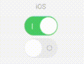

| :warning:        | This is still in development and not ready for use  |
|---------------|:------------------------|


# Maui.CustomSwitch 
[](https://opensource.org/licenses/MIT)

> Breaking changes in version 2.1.0, please see [release notes](https://github.com/IeuanWalker/Xamarin.Forms.CustomSwitch/releases/tag/2.1.0) for more details.

This is a switch/ toggle control that would allow you to create any style switch you'd like. <br>
This component is built on top/ from this great libary - https://github.com/Phenek/Global.InputForms. Fixes a few issues, adds more options for styling and improved accessibility.

Take a look at the sample app included within this project -

## How to use it?
Install the [NuGet package](https://www.nuget.org/packages/IeuanWalker.CustomSwitch) into your shared project project
```
Install-Package IeuanWalker.CustomSwitch
```
#### For android
Permission to use the [vibration](https://docs.microsoft.com/en-us/xamarin/essentials/vibrate?tabs=android) feature is needed.
Open the AndroidManifest.xml file under the Properties folder and add the following inside of the manifest node.
```
<uses-permission android:name="android.permission.VIBRATE" />
```
#### For iOS
Add `CustomSwitchRenderer.Init();` to the `AppDelegate.cs > FinishedLaunching()`

____

The best place to learn how to create a new switch is by looking at the [samples](/Sample/Sample/Sample/Examples/).

These are the key things to know - 
- `BackgroundContent` is used to set the content of the switch
- `KnobContent` is used to set the content on the knob. The content on the knob is hidden/shown by utilising the `IsClippedToBounds` property.
So essentially, as the knob moves from one side to the other it is just revealing a different part of the content.
- The `SwitchPanUpdate` is used transition from true to false, i.e. color fading etc. 

## What can I do with it?
### Properties
| Property | What it does | Extra info |
|---|---|---- |
| IsToggled | A `bool` to indicate the togles status of the switch | Default value is **false** |
| KnobHeight | The height of the knob on the switch | Default value is **0** |
| KnobWidth | The width of the knob on the switch | Default value is **0** |
| KnobColor | The solid color of the knob | Default value is **Color.Default** |
| KnobBackground | The background for the knob, this supports XF brushes to enable gradients, lean more on [MS docs](https://devblogs.microsoft.com/xamarin/xamarinforms-4-8-gradients-brushes/) | Default value is **Brush.Default** |
| KnobCornerRadius | A `CornerRadius` object representing each individual corner's radius for the knob. <br> This is property is implemented using XF corner radius object  | More info on how to use this in the [MS docs](https://docs.microsoft.com/en-us/dotnet/api/xamarin.forms.cornerradius?view=xamarin-forms) <br> Default value is **default(CornerRadius)** |
| HeightRequest | The Height of the switch  | Default value is **0** |
| WidthRequest | The width of the switch  | Default value is **0** |
| CornerRadius | A `CornerRadius` object representing each individual corner's radius for the knob. <br> This is property is implemented using XF corner radius object  | More info on how to use this in the [MS docs](https://docs.microsoft.com/en-us/dotnet/api/xamarin.forms.cornerradius?view=xamarin-forms) <br> Default value is **default(CornerRadius)** |
| BackgroundColor | The solid color of the switch | Default value is **Color.Default** |
| Background | The background for the switch, this supports XF brushes to enable gradients, lean more on [MS docs](https://devblogs.microsoft.com/xamarin/xamarinforms-4-8-gradients-brushes/) | Default value is **Brush.Default** |
| BackgroundContent | Sets the content of the switch.  <br> See [samples](/Sample/Sample/Sample/Examples/) for an  idea how to utilise it  | Default value is **null** |
| KnobContent | Sets the content of the knob.  <br> See [samples](/Sample/Sample/Sample/Examples/) for an  idea how to utilise it | Default value is **null** |
| HorizontalKnobMargin | Adds a margin to the max distance the knob can travel | Default value is **0** |
| KnobLimit | Used to calculate the knob position.  <br> See [samples](/Sample/Sample/Sample/Examples/) for an  idea how to utilise it | Default value is **KnobLimitEnum.Boundary** |
| VibrateDuration | Used to set the duration of the vibration when the switch is toggles | Default value is **20** <br> To disble the vibrate set the value to `0` |
| ToggleAnimationDuration | Used to set the duration of the toggle animation | Default value is **100** <br> To disble the animation set the value to `0` |

### Events
| Event | What it does 
|---|---|
| Toggled | Triggered when the switch is toggled |
| SwitchPanUpdate | Triggered when the switch is toggled or dragged. Used to handle the transition of the switch from one side to the other. <br> See [samples](/Sample/Sample/Sample/Examples/) for an  idea how to utilise it | 

### Commands
| Command | What it does 
|---|---|
| ToggledCommand | Triggered when the switch is toggled |

### Accessibility
Both iOS and android see's this control as a native switch. So from an accessibility POV it behaves like a native switch.

## Examples
### iOS ([xaml](/Sample/Sample/Sample/Examples/IosSwitch.xaml) / [code behind](/Sample/Sample/Sample/Examples/IosSwitch.xaml.cs))


### Android ([xaml](/Sample/Sample/Sample/Examples/AndroidSwitch.xaml) / [code behind](/Sample/Sample/Sample/Examples/AndroidSwitch.xaml.cs))


### Theme 1 ([xaml](/Sample/Sample/Sample/Examples/Theme1Switch.xaml) / [code behind](/Sample/Sample/Sample/Examples/Theme1Switch.xaml.cs))


### Theme 2 ([xaml](/Sample/Sample/Sample/Examples/Theme2Switch.xaml) / [code behind](/Sample/Sample/Sample/Examples/Theme2Switch.xaml.cs))


### Other 1 ([xaml](/Sample/Sample/Sample/Examples/Other1Switch.xaml) / [code behind](/Sample/Sample/Sample/Examples/Other1Switch.xaml.cs))


### Other 2 ([xaml](/Sample/Sample/Sample/Examples/Other2Switch.xaml) / [code behind](/Sample/Sample/Sample/Examples/Other2Switch.xaml.cs))


### Other 3 ([xaml](/Sample/Sample/Sample/Examples/Other3Switch.xaml) / [code behind](/Sample/Sample/Sample/Examples/Other3Switch.xaml.cs))


### Other 4 ([xaml](/Sample/Sample/Sample/Examples/Other4Switch.xaml) / [code behind](/Sample/Sample/Sample/Examples/Other4Switch.xaml.cs))


### Other 5 ([xaml](/Sample/Sample/Sample/Examples/Other5Switch.xaml) / [code behind](/Sample/Sample/Sample/Examples/Other5Switch.xaml.cs))


## License
[](https://app.fossa.com/projects/git%2Bgithub.com%2FIeuanWalker%2FXamarin.Forms.CustomSwitch?ref=badge_large)
